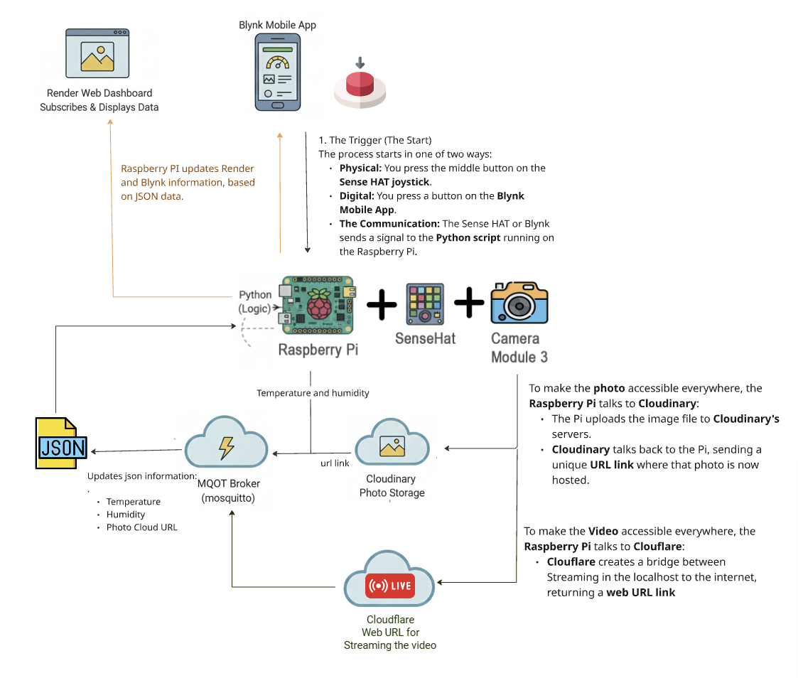

### 📷 Smart Security & Monitoring System: TakePic Pi

IoT TakePic Pi – Raspberry Pi 4 and Camera

📌 Project Overview
- [Youtube Video](https://youtu.be/txTER7NLNN4) - Brief project's showcase.
  
TakePic Pi is a Raspberry Pi-based IoT project that combines sensing devices with remote image capture. It monitors temperature and humidity via the Sense HAT, captures photos using the Pi Camera, allowing you to stream live video, capture environment data, and store security photos in the cloud.

### 🛠 How the Project Works
This project connects hardware, cloud storage, and mobile interfaces to create a smart monitoring system. Here is the role of each component:

* Python: The "Brain" of the project that runs the logic and coordinates all the different services.
* Raspberry Pi: The physical hardware that hosts the code, sensors, and camera.
* Camera: Captures a photo whenever button is pressed (can be a physical button from SenseHat or from the mobile app).source .venv/bin/activate
* MQTT: Updates Json file, send the information to a broker.
* Cloudinary: A digital storage that hosts your photos online so they can be accessed from anywhere.
* Cloudflare: Creates a bridge from your Pi to the internet. The script automatically extracts the public URL and sends it to Blynk.
* Blynk: To create a personal mobile dashboard used to view live temperature, humidity gauges and the image gallery and send a command to take teh picture to raspberry Pi.
* MQTT: A "Broadcaster" that sends a data packet (JSON) to a public broker, mosquitto, every time a photo is taken.
* Render: A web hosting service that runs your project's website, making your data visible in a standard browser.




# Clone the repository
git clone https://github.com/MarciaSatie/raspberrypi_project
cd pi_project


### Render Website link:
https://raspberrypi-project.onrender.com

### Set up virtual environment
```python
python -m venv .venv #if you don't have venv in the project
source .venv/bin/activate
```
### Run main script:
```python
python mycamera.py
```
### 🛠 Technologies Used

Raspberry Pi 4
Raspberry Pi Camera
Python
HTML
MQTT
Cloudinary
CloudFlare
Blynk
Github

### 🧱 IoT Architecture

| Layer           | Implementation                          |
| --------------- | --------------------------------------- |
| **Sensor**      | Raspberry Pi Camera Module              |
| **Processing**  | Python to process the information       |
| **Network**     | Wi-Fi using MQTT,Cloudflare Tunnel      |
| **Cloud**       | Cloudinary to store the picture         | 
|   **Cloud**     | Cloudiflare to provide Url for streaming|
| **Application** | Render for Web dashboard                |
| **Mobile App**  | Blynk for cellphone's remote access     | 

### 🎓 Learning resorces:
#### Logic
- [daemon threading](https://www.geeksforgeeks.org/python/python-daemon-threads/) - To amke teh Streaming run in parallel with main program in the background.
- [dotenv](https://github.com/orgs/community/discussions/151885) - To secure API's and Keys using .env file. 
#### Streaming
- [Streaming with Flask](https://blog.miguelgrinberg.com/post/video-streaming-with-flask) - Exemples about how to use Flask to stream videos.
- [OpenCv](https://www.geeksforgeeks.org/python/python-opencv-imencode-function/) - To translate camera's data in JPG images. 
#### Networking
- [subprocess.Popen](https://www.geeksforgeeks.org/python/python-subprocess-module/) - To execute commands automatically in the terminal and return outputs.
- [Cloudflare Tunnels](https://developers.cloudflare.com/cloudflare-one/connections/connect-networks/) - Securely exposing the MJPEG stream.
- [TryCloudflare Documentation](https://developers.cloudflare.com/cloudflare-one/networks/connectors/cloudflare-tunnel/do-more-with-tunnels/trycloudflare/)- Specifically for creating those temporary .trycloudflare.com links.
